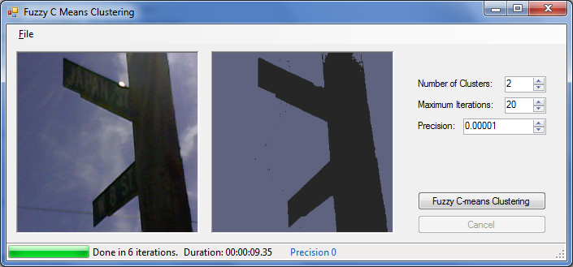

# Computer Vision Applications in C# - Modified Fuzzy C-Means Clustering Algorithm with Spatial Distance to Cluster Center of Gravity

A straightforward implementation of the Fuzzy C-means Clustering algorithm in C# was previously published in [CodeProject](https://www.codeproject.com/Articles/91675/Computer-Vision-Applications-with-C-Fuzzy-C-means-).

This code is a modified version created as an implementation of the research paper: ”Modified Fuzzy C-Means Clustering Algorithm with Spatial Distance to Cluster Center of Gravity”, presented in the 6th IEEE International Workshop on Multimedia Information and Retrieval, Taichung, Taiwan [doi: 10.1109/ISM.2010.53](https://dx.doi.org/10.1109/ISM.2010.53). 

This is a subset of the work "Automated Colorization of Grayscale Images Using Texture Descriptors and a Modified Fuzzy C-Means Clustering", published in the Journal of Intelligent Learning Systems and Applications [doi: 10.4236/jilsa.2012.42013](http://dx.doi.org/10.4236/jilsa.2012.42013).

You can download the compiled Windows executable from the [release page](https://github.com/Christophe-Gauge/FuzzyCMeansClustering/releases/tag/V1.0).

